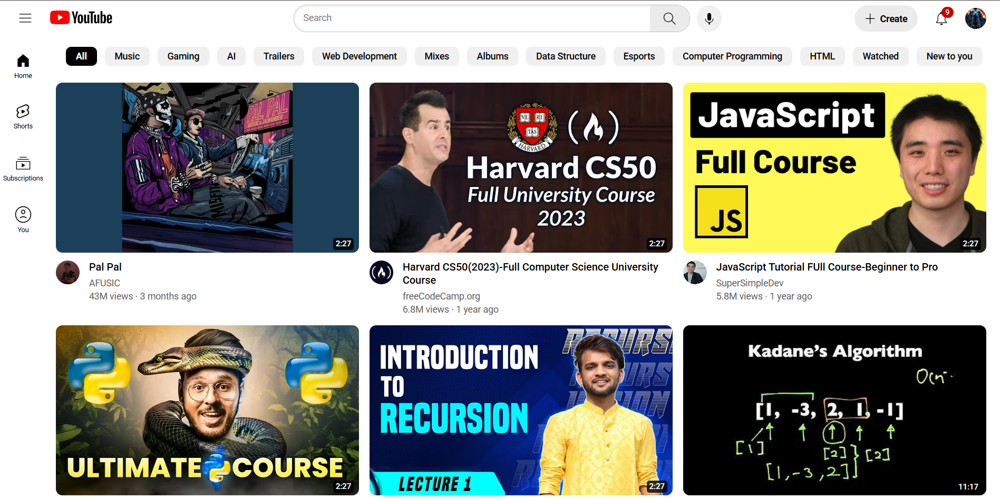

# YouTube.com Clone



A responsive, semantic HTML & CSS clone of YouTube’s main interface—complete with a fixed header, sidebar navigation, search bar interactions, video grid layout, and tooltips.

---

## Table of Contents

* [Demo](#demo)
* [Features](#features)
* [Tech Stack](#tech-stack)
* [Folder Structure](#folder-structure)
* [Installation](#installation)
* [Usage](#usage)
* [Customization](#customization)

---

## Demo

You can view a live demo here:
👉 [GitHub Pages Preview](https://riposis.me/Youtube/)

---

## Features

* **Fixed Header & Sidebar**
  Mimics YouTube’s fixed top nav and collapsible sidebar.

* **Responsive Video Grid**
  Grid adjusts from 1 to 3 columns based on viewport width.

* **Search Bar Interaction**
  Focus‑within styles, dynamic left icon show/hide, pill‑shaped input.

* **Tooltips**
  Custom CSS tooltips for buttons and icons.

* **Semantic HTML5 Elements**
  Uses `<header>`, `<nav>`, `<main>`, `<section>` for accessibility.

* **Hover & Active States**
  Subtle transitions on thumbnails, buttons, and links.

---

## Tech Stack

* **HTML5**
* **CSS3** (Flexbox, Grid, Pseudo‑classes)
* **Google Fonts** (Roboto)
* **No JavaScript** (pure CSS interactions)

---

## Folder Structure

```
.
├── README.md
├── <your_main_file>.html      # rename your main HTML file accordingly
├── styles/
│   ├── general.css
│   ├── header.css
│   ├── second_header.css
│   ├── sidebar.css
│   └── video.css
├── icons/
│   ├── hamburger-menu.svg
│   ├── youtube-logo.svg
│   └── …more icons
├── thumbnail/
│   ├── hq720.avif
│   └── …more thumbnails
└── channel-pic/
    ├── Aryan.jpg
    └── …more channel pics
```

---

## Installation

1. **Clone the repo**

   ```bash
   git clone https://github.com/RIP0SIS/Youtube-Clone.git
   ```

2. **Open your HTML file**
   Simply double-click your main HTML file (e.g. `youtube.html`), or run a local server:

---

## Usage

* **Search Bar**: Click or tab into the input to reveal left‑icon and blue outline.
* **Tooltips**: Hover over icons to see descriptive tooltips.
* **Video Thumbnails**: Hover for a slight opacity change and rounded‑corner transition.
* **Responsive**: Resize the window to see 1→2→3 column layout.

---

## Customization

* **Colors & Fonts**
  Edit `styles/general.css` to swap fonts or tweak color variables.

* **Icons & Images**
  Replace `icons/` and `thumbnail/` assets with your own.

* **Grid Breakpoints**
  Change the media queries in `video.css` to adjust column counts.
